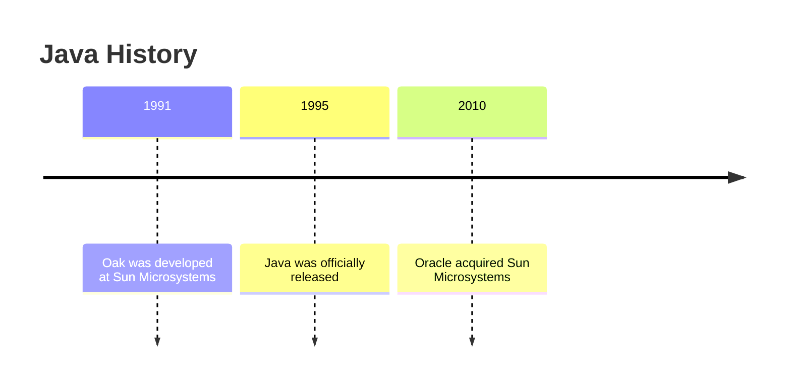

# 01. Java History

---

> **Java:** A statically typed, general-purpose programming language known for compiling source code into bytecode that runs on the JVM.

## 📜 History Timeline

| Year | Milestone |
|---|---|
| **1991** | Java was originally developed as **"Oak"** by **James Gosling and his team at Sun Microsystems**. |
| **1995** | **Java** was officially released. |
| **2010** | **Oracle acquired Sun Microsystems**, so Java came under Oracle. |

## 🔄 From Oak to Java

> **Remember:** **1991 → Oak → Sun Microsystems**  
> **1995 → Java officially released**  
> **2010 → Oracle acquired Sun Microsystems**

## 🧠 Quick Understanding

### 1991 — Oak
Java started as **Oak**, developed by **James Gosling and his team at Sun Microsystems**.

### 1995 — Java
The language was officially released as **Java**.

### 2010 — Oracle
**Oracle acquired Sun Microsystems**, bringing Java under Oracle.

## ⚡ 30-Second Revision

- **1991** → Oak
- **James Gosling + Sun Microsystems**
- **1995** → Java officially released
- **2010** → Oracle acquired Sun Microsystems

🎯 Interview Quick Question

**Q: Who developed Java originally, and what was it called?**

**A:** Java was originally developed by **James Gosling and his team at Sun Microsystems** in **1991**, and it was called **Oak**.

---

## 🧭 Navigation

⬅️ [Java Notes Home](../README.md) &nbsp; • &nbsp; 📚 [Fundamentals](./) &nbsp; • &nbsp; ☕ Keep learning!
