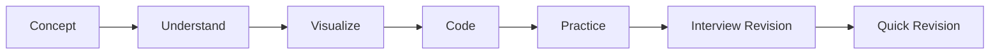

# ☕ Java Notes

> A structured, practical Java knowledge base covering Core Java, JVM internals, coding examples, interview preparation and quick revision.

## 📚 Learning Path

| # | Section | Status | Focus |
|---:|---|:---:|---|
| 01 | Fundamentals | ✅ Done | History, Java editions, execution flow, JDK/JRE/JVM, JVM, features |
| 02 | Data Types | 🔄 In Progress | Primitive & reference types |
| 03 | OOP | ⏳ Upcoming | Classes, objects, inheritance, polymorphism, abstraction, encapsulation |
| 04 | Exception Handling | ⏳ Upcoming | Exceptions, custom exceptions, try-catch, finally |
| 05 | Collections | ⏳ Upcoming | List, Set, Map, Queue, iterators, collection internals |
| 06 | Generics | ⏳ Upcoming | Generic classes, methods, wildcards, type safety |
| 07 | Java 8 | ⏳ Upcoming | Lambdas, functional interfaces, Optional, Date/Time API |
| 08 | Stream API | ⏳ Upcoming | Stream operations, collectors, grouping, reduction |
| 09 | Multithreading | ⏳ Upcoming | Threads, synchronization, executors, concurrency |
| 10 | I/O & NIO | ⏳ Upcoming | Files, streams, readers/writers, NIO |
| 11 | JDBC | ⏳ Upcoming | Database connectivity, queries, prepared statements |
| 12 | JVM & Internals | ⏳ Upcoming | Advanced JVM, memory, class loading, execution, GC |
| 13 | Modern Java | ⏳ Upcoming | Features after Java 8 and current Java practices |

---

## 🧭 Repository Structure

```text
java-notes/
│
├── 01-fundamentals/              ✅ DONE
│   ├── 01-java-history.md
│   ├── 02-java-editions.md
│   ├── 03-java-execution-flow.md
│   ├── 04-jdk-jre-jvm.md
│   ├── 05-jvm.md
│   ├── 06-java-features.md
│   └── 07-java-fundamentals-quick-revision.md
│
├── 02-data-types/                🔄 IN PROGRESS
│   ├── 01-data-types-overview.md
│   ├── 02-primitive-data-types.md
│   ├── 03-reference-data-types.md
│   └── 04-data-types-quick-revision.md
│
├── 03-oops/
├── 04-exception-handling/
├── 05-collections/
├── 06-generics/
├── 07-java-8/
├── 08-stream-api/
├── 09-multithreading/
├── 10-io-nio/
├── 11-jdbc/
├── 12-jvm/
└── 13-modern-java/
```

---

## 🟢 01 — Fundamentals — COMPLETE

The Fundamentals section is now complete.

### Topics Covered

| # | Topic | Status |
|---:|---|:---:|
| 01 | [Java History](01-fundamentals/01-java-history.md) | ✅ |
| 02 | [Java Editions](01-fundamentals/02-java-editions.md) | ✅ |
| 03 | [Java Execution Flow](01-fundamentals/03-java-execution-flow.md) | ✅ |
| 04 | [JDK → JRE → JVM](01-fundamentals/04-jdk-jre-jvm.md) | ✅ |
| 05 | [JVM Architecture](01-fundamentals/05-jvm.md) | ✅ |
| 06 | [Features of Java](01-fundamentals/06-java-features.md) | ✅ |
| 07 | [Fundamentals Quick Revision](01-fundamentals/07-java-fundamentals-quick-revision.md) | ✅ |

> 🎉 **Fundamentals complete!** The next major section is **Data Types**.

---

## 🔵 02 — Data Types — IN PROGRESS

### Current Topics

| # | Topic | Status |
|---:|---|:---:|
| 01 | [Data Types Overview](02-data-types/01-data-types-overview.md) | ✅ |
| 02 | [Primitive Data Types](02-data-types/02-primitive-data-types.md) | ✅ |
| 03 | [Reference Data Types](02-data-types/03-reference-data-types.md) | ✅ |
| 04 | [Data Types Quick Revision](02-data-types/04-data-types-quick-revision.md) | ✅ |

---

## ✨ Note Structure

Each topic is organized for **learning + revision**, with content added according to what the topic needs:

- 📌 Clear explanations
- 🔀 Visual flows and diagrams
- 📊 Comparison tables
- 💻 Java examples
- 🧠 Memory tricks
- 🎯 Interview questions
- ⚡ 30-second / quick revision
- 🔗 Navigation between related topics

> **One source image can contain multiple concepts. We split it into logical topic files whenever that makes the notes easier to read, search and revise.**

---

## 🔄 Learning Flow



---

## 🎯 Goal

Build a **complete, searchable and continuously improving Java knowledge base** that connects:

**Concept → Understanding → Code → Practice → Interview → Revision**

---

<div align="center">

### ☕ Learn Java deeply. Build consistently. Revise quickly.

**Mukesh Pilla**

</div>
