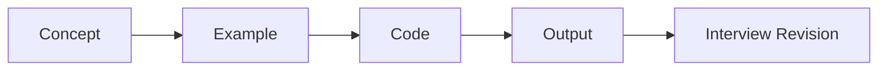

# Java Notes

> A structured, practical Java learning repository covering fundamentals, core concepts, modern Java, coding examples, and interview revision.

## 📚 Learning Path

| # | Section | Focus |
|---|---|---|
| 01 | Fundamentals | Java history, JDK, JRE, JVM, syntax, data types, operators |
| 02 | OOP | Classes, objects, inheritance, polymorphism, abstraction, encapsulation |
| 03 | Exception Handling | Exceptions, custom exceptions, try-catch, finally |
| 04 | Collections | List, Set, Map, Queue, iterators, collection internals |
| 05 | Generics | Generic classes, methods, wildcards, type safety |
| 06 | Java 8 | Lambdas, functional interfaces, Optional, Date/Time API |
| 07 | Stream API | Stream operations, collectors, grouping, reduction |
| 08 | Multithreading | Threads, synchronization, executors, concurrency |
| 09 | I/O & NIO | Files, streams, readers/writers, NIO |
| 10 | JDBC | Database connectivity, queries, prepared statements |
| 11 | JVM | Class loading, memory areas, execution engine, GC |
| 12 | Modern Java | Features introduced after Java 8 and current Java practices |

## 🧭 Repository Structure

```text
java-notes/
├── 01-fundamentals/
│   ├── 01-java-history.md
│   ├── 02-java-editions.md
│   ├── 03-java-execution-flow.md
│   ├── 04-jdk-jre-jvm.md
│   ├── 05-jvm.md
│   ├── 06-java-features.md
│   └── 07-java-fundamentals-quick-revision.md
├── 02-oops/
├── 03-exception-handling/
├── 04-collections/
├── 05-generics/
├── 06-java-8/
├── 07-stream-api/
├── 08-multithreading/
├── 09-io-nio/
├── 10-jdbc/
├── 11-jvm/
└── 12-modern-java/
```

## 📝 Fundamentals — Current Topics

1. [Java History](01-fundamentals/01-java-history.md)
2. [Java Editions](01-fundamentals/02-java-editions.md)
3. [Java Execution Flow](01-fundamentals/03-java-execution-flow.md)
4. [JDK → JRE → JVM](01-fundamentals/04-jdk-jre-jvm.md)
5. [JVM](01-fundamentals/05-jvm.md)
6. [Features of Java](01-fundamentals/06-java-features.md)
7. [Java Fundamentals — Quick Revision](01-fundamentals/07-java-fundamentals-quick-revision.md)

> **Note:** One source image can contain multiple concepts. Topics are split into separate files whenever that makes the notes easier to read, search, revise, and maintain.

## ✨ What Each Topic Contains

- Clear concept explanations
- Practical Java examples
- Expected output where useful
- Mermaid diagrams and visual flows
- Comparison tables
- Interview-focused questions
- Quick revision points
- Notes organized for long-term reference

## 🔁 Learning Flow



## 🎯 Goal

Build a searchable, continuously improving Java knowledge base that connects **concept → code → practical understanding → interview revision**.

---

> 📌 Notes are continuously updated as new topics are learned and refined.
